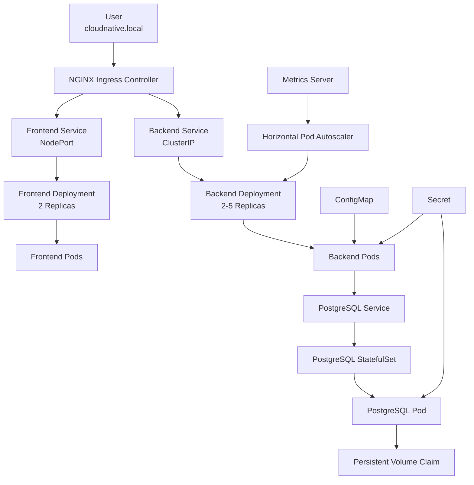

# Cloud Native Application Architecture

```mermaid
flowchart TD

    User["User<br/>cloudnative.local"]

    Ingress["NGINX Ingress Controller"]

    FrontendSvc["Frontend Service<br/>NodePort"]
    BackendSvc["Backend Service<br/>ClusterIP"]

    FrontendDeploy["Frontend Deployment<br/>2 Replicas"]
    BackendDeploy["Backend Deployment<br/>2-5 Replicas"]

    FrontendPods["Frontend Pods"]
    BackendPods["Backend Pods"]

    DBSvc["PostgreSQL Service"]
    DBStateful["PostgreSQL StatefulSet"]
    DBPod["PostgreSQL Pod"]
    PVC["Persistent Volume Claim"]

    ConfigMap["ConfigMap"]
    Secret["Secret"]

    Metrics["Metrics Server"]
    HPA["Horizontal Pod Autoscaler"]

    User --> Ingress

    Ingress --> FrontendSvc
    Ingress --> BackendSvc

    FrontendSvc --> FrontendDeploy
    FrontendDeploy --> FrontendPods

    BackendSvc --> BackendDeploy
    BackendDeploy --> BackendPods

    BackendPods --> DBSvc
    DBSvc --> DBStateful
    DBStateful --> DBPod
    DBPod --> PVC

    ConfigMap --> BackendPods
    Secret --> BackendPods
    Secret --> DBPod

    Metrics --> HPA
    HPA --> BackendDeploy
```